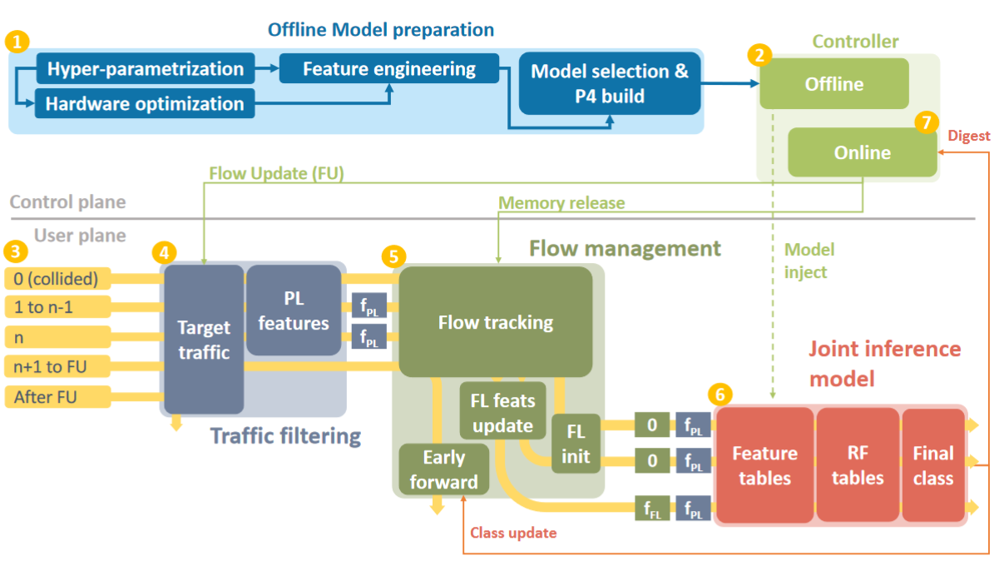

# Jewel: Resource-Efficient Joint Packet and Flow Level Inference in Programmable Switches

This repository contains the source code for our work Jewel which will appear in the Proceedings of IEEE INFOCOM 2024, 20-23 May 2024, Vancouver, Canada.

## Overview of Jewel
  

Jewel is an in-switch inference framework that can run Random Forest (RF) models at both packet-level and flow-level in real-world programmable switches. It
enables the embedding of RF models into production-grade programmable hardware, for challenging inference tasks, ensuring that all packets are classified. Jewel is implemented as open-source software using the P4 language.

For full details, please consult <a href="https://dspace.networks.imdea.org/handle/20.500.12761/1777">our paper</a>.

## Organization of the repository  
There are three folders:  
<!-- - _Data_ : information on how to access the data  -->
- _P4_ : The P4 code for Tofino and the M/A table entries
- _Python_ : The jupyter notebook for training the machine learning models (_unsw_model_analysis_26_classes.ipynb_), and the python scripts for generating the M/A table entries from the saved trained models (_convert_RF_to_table_entries.py_) and for generating the train/test data of the joint solution with the generated features for the first N packet (_clean_and_label_n_pkts_hybrid.py_). Also, a bash script to extract pcap capture and call  _clean_and_label_n_pkts_hybrid.py_ to generate the train/test data for the specific N value. (N=the rank of the packet for which the Flow-Level inference is triggered.)
- _Controller_: The python script that realizes control plane functionality to store statistics, release of the flow tracking registers occupied by the flow and update target traffic table upon receiving a digest from the switch.


## Use cases
The use cases considered in the paper are: 
- IoT device identification task based on the publicly available <a href="https://iotanalytics.unsw.edu.au/iottraces.html">UNSW-IOT Traces</a>. <br>The challenge is to classify traffic into one of 16 or 26 classes. 
- Protocol classification with 8 protocol classes, based on the <a href="http://netweb.ing.unibs.it/~ntw/tools/traces/">UNIBS 2009 Internet Traces</a>.
- Malicious traffic detection task with 10 malware and 4 benign traffic classes generated from Internet of Things (IoT) devices, based on the puclicly available <a href="https://www.stratosphereips.org/datasets-iot23">Aposemat IoT-23</a>.
- Cyberattack identification task with benign traffic and 9 types of cyberattacks. It is based on the <a href="https://research.unsw.edu.au/projects/toniot-datasets">ToN_IoT</a> dataset.

We provide the python and P4 code for the UNSW-IoT device identification use case with 26 classes. <br> The same approach for generating the train/test data for the joint solution, feature/model selection, and encoding to P4 applies to all the use cases. 

You can access the train/test files and packet count file for the test data for this use case from this<a href="https://box.networks.imdea.org/s/4QWdzOoxG8BWlkF"> Box folder</a>.

## Citation
If you make use of this code, kindly cite our paper:  
```
@inproceedings{jewel-2024,
author = {Akem, Aristide Tanyi-Jong and Bütün, Beyza and Gucciardo, Michele and Fiore, Marco},
title = {Jewel: Resource-Efficient Joint Packet and Flow Level Inference in Programmable Switches},
year = {2024},
publisher = {},
address = {},
url = {},
doi = {},
booktitle = {Proceedings of the 2024 IEEE International Conference on Computer Communications},
numpages = {10},
location = {Vancouver, Canada},
series = {INFOCOM 2024}
}
```

If you need any additional information, send us an email at _beyza.butun_ at _imdea.org_ or _aristide.akem_ at _imdea.org_.


